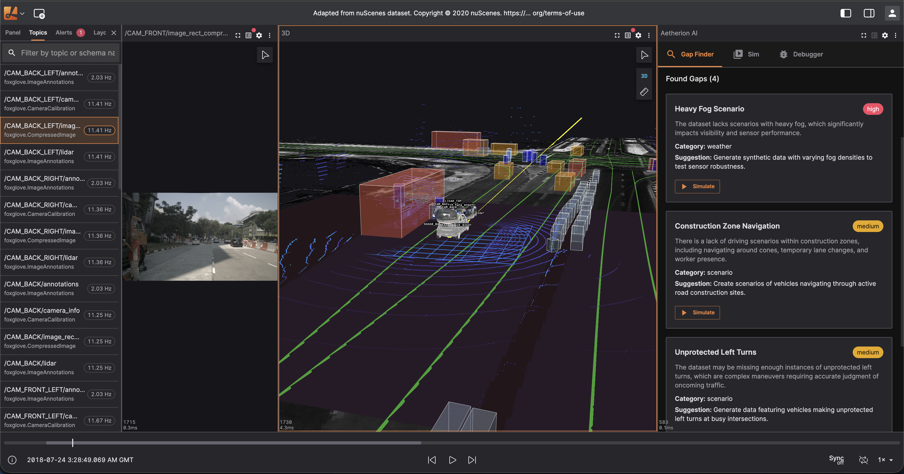
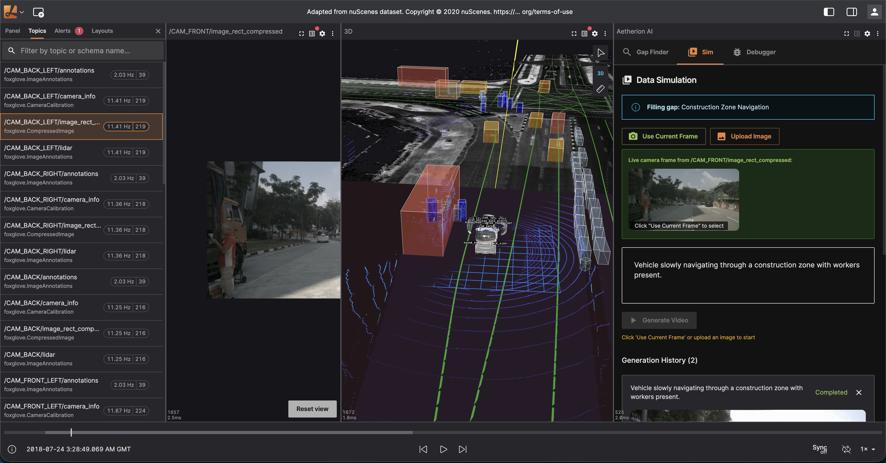
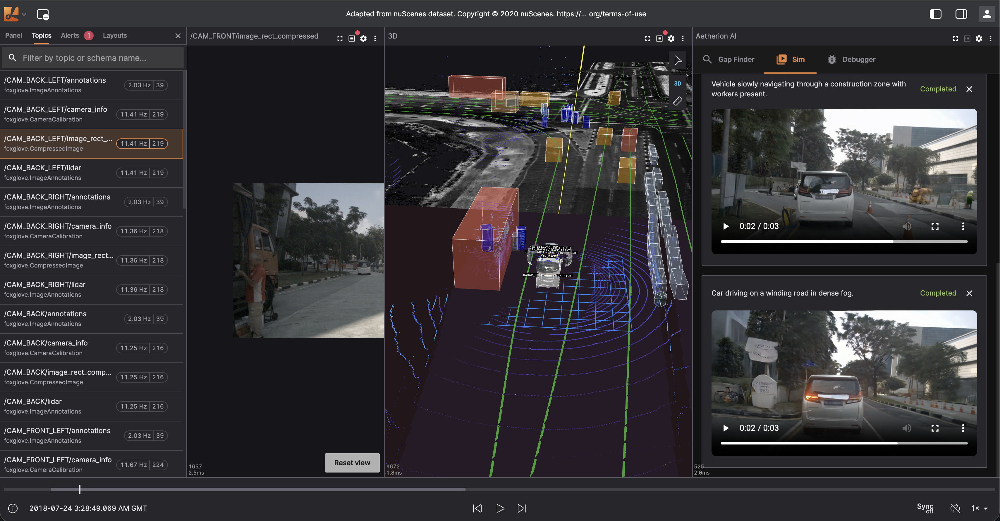

# Aetherion AI

**AI-powered autonomous vehicle data analysis platform for the NVIDIA Cosmos Cookoff**

Aetherion AI transforms how robotics engineers analyze, debug, and augment their autonomous vehicle datasets using NVIDIA's Cosmos Reason 2 and Cosmos Predict2 models.

<p align="center">
  
</p>
<p align="center">
  
</p>
<p align="center">
  
</p>

## The Problem

Autonomous vehicle development teams face three critical challenges:

1. **Data Gaps**: Real-world driving datasets are expensive to collect and often miss edge cases (rain, night driving, construction zones). Engineers don't know what scenarios are missing until failures occur in production.

2. **Debugging Complexity**: When an AV behaves unexpectedly, engineers must manually sift through thousands of sensor messages (LiDAR, cameras, IMU, GPS) to understand what happened. This takes hours or days.

3. **Synthetic Data Generation**: Creating realistic training data for missing scenarios requires expertise in multiple tools and manual prompt engineering.

## The Solution

Aetherion AI is a visualization platform with an integrated AI panel that uses **NVIDIA Cosmos** to solve all three challenges:

### 1. Gap Finder (Cosmos Reason 2)
Analyzes your dataset's topic structure and identifies missing driving scenarios using Cosmos Reason 2's physical AI reasoning capabilities.

**How Cosmos Reason 2 is used:**
- Receives dataset metadata (topics, duration, sensor types)
- Uses vision-language reasoning to understand physical world context
- Identifies coverage gaps based on real-world driving scenarios
- Generates actionable prompts for synthetic data generation
- Outputs structured JSON for seamless UI integration

```
Input: 41 topics, 45s duration, camera/LiDAR/radar sensors
Output: "Missing: Night driving scenarios, Heavy rain conditions, Construction zone navigation"
```

### 2. Data Simulation (Cosmos Predict2)
Generates synthetic driving videos to fill identified gaps.

**How it works:**
- Captures live camera frames from your ROS bag data
- Combines frame + AI-generated prompt from Gap Finder
- Sends to Cosmos Predict2 Video2World model
- Returns realistic synthetic driving video

### 3. AI Debugger (Cosmos Reason 2)
Natural language interface for analyzing sensor data at any timestamp using Cosmos Reason 2's physical world understanding.

**How Cosmos Reason 2 is used:**
- Receives live sensor data (pose, velocity, IMU, camera frames, LiDAR points)
- Engineers ask questions in plain English: "Why did the vehicle brake suddenly?"
- Cosmos Reason 2 analyzes visual and sensor data with physical AI reasoning
- Understands spatial relationships, object interactions, and physical plausibility
- Supports follow-up questions for deep debugging

```
Q: "Is the IMU data normal at this timestamp?"
A: "The IMU shows angular velocity of (0.02, -0.01, 0.15) rad/s which indicates
    a gentle right turn. Linear acceleration of (0.5, 0.1, 9.8) m/s² shows mild
    braking with normal gravity. These values are within expected ranges for
    urban driving at ~30 km/h."
```

## Architecture

```
┌─────────────────────────────────────────────────────────────┐
│                     Aetherion AI Panel                       │
├───────────────┬───────────────────┬─────────────────────────┤
│   Gap Finder  │   Data Simulation │      AI Debugger        │
│               │                   │                         │
│  ┌─────────┐  │  ┌─────────────┐  │  ┌───────────────────┐  │
│  │ Cosmos  │  │  │Camera Frame │  │  │  Live Sensor Data │  │
│  │Reason 2 │  │  │  Capture    │  │  │  (pose, IMU, etc) │  │
│  └────┬────┘  │  └──────┬──────┘  │  └─────────┬─────────┘  │
│       │       │         │         │            │            │
│       ▼       │         ▼         │            ▼            │
│  Gap Analysis │  Cosmos Predict2  │     Cosmos Reason 2     │
│    + Prompts  │  Video Generation │   Physical AI Reasoning │
└───────────────┴───────────────────┴─────────────────────────┘
                              │
                              ▼
              ┌───────────────────────────────┐
              │   Lichtblick Visualization    │
              │   (ROS bag playback, 3D view, │
              │    plots, image panels)       │
              └───────────────────────────────┘
```

## Cosmos Reason 2 Integration Details

### Why Cosmos Reason 2?

Cosmos Reason 2 is purpose-built for physical AI applications. Unlike general-purpose LLMs, it excels at:

- **Spatial Understanding**: Reasoning about object positions, distances, and trajectories
- **Physical Plausibility**: Understanding what makes sense in the real world
- **Egocentric Reasoning**: Analyzing scenes from the vehicle's perspective
- **Social-Physical Interactions**: Understanding robot-human interactions and traffic scenarios

### Features Used

| Feature | Usage |
|---------|-------|
| **Vision-Language Reasoning** | Analyzing camera frames with sensor context |
| **Physical World Understanding** | Gap analysis, anomaly detection |
| **Structured Output (JSON)** | Gap cards with title, severity, category, prompts |
| **Egocentric Reasoning** | Vehicle-perspective scene understanding |
| **Real-time Inference** | Live debugging responses |

### Sample Prompts

**Gap Finder:**
```
You are an autonomous vehicle data analyst using physical AI reasoning.
Identify missing driving scenarios in this dataset based on real-world
coverage requirements. Dataset: 41 topics, 45s duration. Find 3-5 gaps
with simple video generation prompts like "Car driving on a rainy highway at night".
```

**Debugger:**
```
You are an AV systems debugger with physical world understanding.
Live sensor data at timestamp 2.25s:
[/ego_pose] pos:(1547.23, 892.45, 0.12), vel:(8.2, 0.1, 0.0)
[/imu] accel:(0.5, 0.1, 9.8), gyro:(0.02, -0.01, 0.15)
[/CAM_FRONT/annotations] 12 detection points

User question: "Why did the vehicle slow down?"
Analyze the sensor values and physical context to explain.
```

## Quick Start

```bash
# Clone the repository
git clone https://github.com/samadon1/aetherion-ai.git
cd aetherion-ai

# Enable corepack
corepack enable

# Install dependencies
yarn install

# Configure environment variables (optional)
cp .env.example .env
# Edit .env and add your API keys

# Start development server
yarn web:serve
```

Open http://localhost:8080 in your browser.

### Configuration

**Option 1: Environment Variables (Recommended for deployment)**

Copy `.env.example` to `.env` and add your API keys:

```bash
COSMOS_REASON_ENDPOINT=your_cosmos_reason_endpoint_here
COSMOS_PREDICT_ENDPOINT=your_cosmos_predict_endpoint_here
```

**Option 2: Panel Settings**

1. Add the **AetherionAI** panel from the panel list
2. Click the settings gear icon
3. Configure:
   - **Cosmos Reason Endpoint**: Your Cosmos Reason 2 API endpoint
   - **Cosmos Predict Endpoint**: Your Cosmos Predict2 API endpoint

## Demo Video

[](https://youtu.be/iM1paskyHIY)

[Watch the demo on YouTube](https://youtu.be/iM1paskyHIY)

## Tech Stack

- **Frontend**: React, TypeScript, Material-UI
- **Visualization**: Lichtblick (fork of Foxglove Studio)
- **AI Reasoning**: NVIDIA Cosmos Reason 2
- **Video Generation**: NVIDIA Cosmos Predict2 Video2World
- **Data Formats**: ROS bags, MCAP files

## Resources

- [NVIDIA Cosmos Cookbook](https://github.com/NVIDIA/Cosmos)
- [Cosmos Reason 2 Documentation](https://developer.nvidia.com/cosmos)
- [NVIDIA Cosmos Cookoff Participation Guide](https://lu.ma/NVIDIACosmosCookoff)

## Built On

This project is built on [Lichtblick](https://github.com/Lichtblick-Suite/lichtblick), an open-source robotics visualization tool. Lichtblick originated as a fork of [Foxglove Studio](https://github.com/foxglove/studio).

## License

Mozilla Public License 2.0 (MPL-2.0)

---

**Built for the NVIDIA Cosmos Cookoff by Samuel Donkor**
